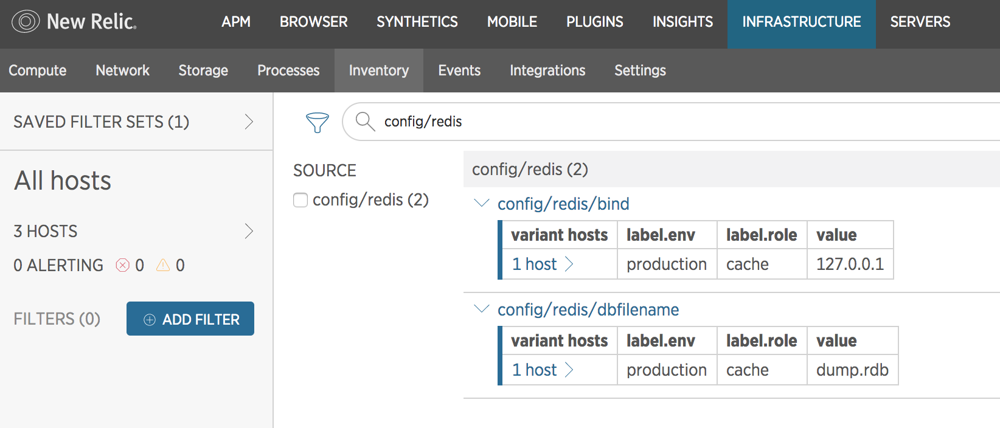

# Tutorial

## Overview
This tutorial will guide you through the process of developing a custom integration for New Relic Infrastructure in the Go language. To simplify the process, New Relic provides the following tools:
* [nr-integrations-builder](https://github.com/newrelic/nr-integrations-builder): command line tool that generates an integration "scaffold", with basic integration files in the correct directory structure.
* [Integration Golang SDK](https://github.com/newrelic/infra-integrations-sdk/): a Golang package containing a set of useful functions and types for creating metrics and inventory data structure.

For a simple overview of what Infrastructure integrations are and how they work, see the [Intro to the Integrations SDK](https://docs.newrelic.com/docs/infrastructure/integrations-sdk/get-started/intro-infrastructure-integrations-sdk).

This tutorial is compatible with `nr-integration-builder` v1.0.x and `Integration Golang SDK` v1.0.x.

## Prerequisites
To successfully complete this tutorial you must:
* Be familiar with Golang
* Install [the Vendor Tool for Go](https://github.com/kardianos/govendor)
* Have access to a [supported Linux OS](https://docs.newrelic.com/docs/infrastructure/new-relic-infrastructure/getting-started/compatibility-requirements-new-relic-infrastructure#operating-systems)
* Install [Go](https://golang.org/doc/install)
* Install [Redis](https://redis.io/topics/quickstart)
* Install the [New Relic Infrastructure Agent](https://docs.newrelic.com/docs/infrastructure/new-relic-infrastructure/installation/install-infrastructure-linux)
* Modify Git configuration using
```bash
$ git config --global url."git@github.com:newrelic".insteadOf "https://github.com/newrelic"
```

## Building the structure of the integration
**Step1: Install nr-integrations-builder**

Install `nr-integrations-builder`
```bash
$ go get github.com/newrelic/nr-integrations-builder
```

This command will create the `nr-integrations-builder` executable. Depending on your Go tools settings it could be placed inside `$GOBIN` or `$GOPATH/bin`. Make sure the directory of the folder with your Go binaries is placed in your `$PATH` environment variable and run
```bash
$ nr-integrations-builder --help
```
If the Golang binary folder is not in your `$PATH` you will have to run
```bash
$ $GOBIN/nr-integrations-builder --help
```
or
```bash
$ $GOPATH/bin/nr-integrations-builder --help
```

This tutorial assumes that your `$GOBIN` or `$GOPATH/bin` has been added to your `$PATH` environment variable.

**Step 2: Check govendor tool**

Before initializing the integration with `nr-integrations-builder` you have to check that the `govendor` tool (used for managing dependencies) is successfully installed. Run the following command:
```bash
$ govendor
```
You should receive the description about the `govendor` tool with the list of accepted commands. More information about the usage can be found in the [README.md](https://github.com/kardianos/govendor/blob/master/README.md).

**Step 3: Initialize the integration**

To initialize the integration and generate the scaffold, run
```bash
$ nr-integrations-builder init integration_name
```
To see the list of the parameters that you can specify, type
```bash
$ nr-integrations-builder init --help
```

After initializing the integration you should receive information that the scaffold was successfully created. If it failed you will get an error message.

Your current directory will be used as the default destination. The following structure of the files and folders will be created:

* _integration\_name_
  * CHANGELOG.md
  * LICENSE
  * README.md
  * Makefile
  * _integration\_name_-config.yml.sample
  * _integration\_name_-definition.yml  
  * src
    * _integration\_name_.go  
    * _integration\_name_\_test.go
  * vendor
    * vendor.json
    * _external\_packages_name_

## Building a Redis integration using the Integration Golang SDK v1.0
**Step1:** Create the directory where you want to place the Redis integration (it needs to be under `$GOPATH/src`)
```bash
$ mkdir $GOPATH/src/nr-integrations/
$ cd $GOPATH/src/nr-integrations/
```
**Step2:** Initialize the integration
```bash
$ nr-integrations-builder init redis --company-prefix "nr"
```
**Step 3:** Go to the directory you created and build the executable file
```bash
cd redis/
make
```
**Step 4:** Test that the integration was created properly by running
```bash
$ ./bin/nr-redis -pretty
```
The following JSON payload will be printed to stdout:
```bash
{
	"name": "redis",
	"protocol_version": "1",
	"integration_version": "0.1.0",
	"metrics": [
		{
			"event_type": "RedisSample"
		}
	],
	"inventory": {},
	"events": []
}
```
This is the basic JSON data format that is expected by the Infrastructure agent. The main logic is placed in `src/redis.go`, which is [the integration executable file](https://docs.newrelic.com/docs/create-integration-executable-file).

When the integration is initialized with `nr-integrations-builder`, the
executable file builds the JSON output data with three header fields (_name_,
_protocol_version_,
_integration_version_),
[metrics data](https://docs.newrelic.com/docs/create-integration-executable-file#metric-data) (with
the mandatory _event_type_ field), and an empty structure for [inventory](https://docs.newrelic.com/docs/create-integration-executable-file#inventory) and [events data](https://docs.newrelic.com/docs/create-integration-executable-file#event-data).

The SDK package contains a function called `NewIntegration`, which initializes a new instance of integration data. If you run the following simplified `main` function that calls `NewIntegration`:
```go
func main() {
	integration, err := sdk.NewIntegration(integrationName, integrationVersion, &args)
	fatalIfErr(err)

	// the code for populating Inventory and Metrics omitted

	fatalIfErr(integration.Publish())
}
```
you will receive the following output:
```bash
{
	"name": "redis",
	"protocol_version": "1",
	"integration_version": "0.1.0",
	"metrics": [],
	"inventory": {},
	"events": []
}
```

### Fetching metric data
Let's start by defining the metric data. `MetricSet` is the basic structure for storing metrics. The `NewMetricSet` function returns a new instance of MetricSet with its sample attached to the integration data.

Next, if you think it's necessary, modify the argument for `NewMetricSet` in the
code. By default, `nr-integrations-builder` generates an Event Type
automatically using the name of the integration + 'Sample'.  Your `main`
function should look like:
```go
func main() {
	integration, err := sdk.NewIntegration(integrationName, integrationVersion, &args)
	fatalIfErr(err)

	// the code for populating Inventory omitted

	if args.All || args.Metrics {
		ms := integration.NewMetricSet("RedisSample")
		fatalIfErr(populateMetrics(ms))
	}

	fatalIfErr(integration.Publish())
}
```

After building and executing the integration the following output is returned:
```bash
{
	"name": "redis",
	"protocol_version": "1",
	"integration_version": "0.1.0",
	"metrics": [
		{
            "event_type": "RedisSample"
        }
	],
	"inventory": {},
	"events": []
}
```
In order to define the metric value, we will use the function `SetMetric` from the `SDK package`. `nr-integrations-builder` automatically generates the `populateMetrics` function:
```go
func populateMetrics(ms *metric.MetricSet) error {
	// Insert here the logic of your integration to get the metrics data
	// Ex: ms.SetMetric("requestsPerSecond", 10, metric.GAUGE)
	// --
	return nil
}
```
Uncomment the line that calls the `SetMetric` function:
```go
func populateMetrics(ms *metric.MetricSet) error {
	// Insert here the logic of your integration to get the metrics data
	ms.SetMetric("requestsPerSecond", 10, metric.GAUGE)
	// --
	return nil
}
```
and build and execute the integration. You will receive the following output
```bash
{
	"name": "redis",
	"protocol_version": "1",
	"integration_version": "0.1.0",
	"metrics": [
		{
			"event_type": "RedisSample",
            "requestsPerSecond": 10
		}
	],
	"inventory": {},
	"events": []
}
```
The function `SetMetric` requires three arguments. The first one is the _metric name_, the second is the _metric value_, and the last one is the _source type_ of the metric.

The metric source type can be one of the following: GAUGE, RATE, DELTA or ATTRIBUTE. Continue reading to understand how to use the different source types.

The `redis-cli info` command returns a list of redis performance and health metrics.

If you run
```bash
redis-cli info | grep instantaneous_ops_per_sec:
```
you will receive
```bash
instantaneous_ops_per_sec:4
```
This is the number of commands processed per second. This is a numeric value
that may increase or decrease and it should be stored as-is. Use the GAUGE
source type in these cases. For metric names, it is recommended that you use a prefix to categorize
them, innerCamelCase naming format, and specify the measurement unit using a unit suffix, i.e. PerSecond. In this case, for the metric data key, use `query.instantaneousOpsPerSecond`:

```go
func populateMetrics(ms *metric.MetricSet) error {
	cmd := exec.Command("/bin/sh", "-c", "redis-cli info | grep instantaneous_ops_per_sec:")
	output, err := cmd.CombinedOutput()
	if err != nil {
		return err
	}
	splitedLine := strings.Split(string(output), ":")
	if len(splitedLine) != 2 {
		return fmt.Errorf("Cannot split the output line")
	}
	metricValue, err := strconv.ParseFloat(strings.TrimSpace(splitedLine[1]), 64)
	if err != nil {
		return err
	}
    ms.SetMetric("query.instantaneousOpsPerSecond", metricValue, metric.GAUGE)

	return nil
}
```

After building and executing the integration, you should receive
```bash
{
	"name": "redis",
	"protocol_version": "1",
	"integration_version": "0.1.0",
	"metrics": [
		{
			"event_type": "RedisSample",
            "query.instantaneousOpsPerSecond": 3
		}
	],
	"inventory": {},
	"events": []
}
```


Using command
```bash
redis-cli info | grep total_connections_received:
```
you will receive
```bash
total_connections_received:111
```
This provides information about the total number of connections accepted by the server. This is an ever-growing value which might be reset. In a case like this it is more useful to store the change rate instead of the as-is value. We use the RATE type and the SDK will automatically compute the change rate.

Modify the `populateMetrics` function to process the metric data using the RATE type
```go
func populateMetrics(ms *metric.MetricSet) error {
  // ...
  // previous code for getting `instantaneous_ops_per_sec` omitted
  // ...

	cmd = exec.Command("/bin/sh", "-c", "redis-cli info | grep total_connections_received:")
	output, err = cmd.CombinedOutput()
	if err != nil {
		return err
	}
	splitedLine = strings.Split(string(output), ":")
	if len(splitedLine) != 2 {
		return fmt.Errorf("Cannot split the output line")
	}
	metricValue, err = strconv.ParseFloat(strings.TrimSpace(splitedLine[1]), 64)
	if err != nil {
		return err
	}

    ms.SetMetric("net.connectionsReceivedPerSecond", metricValue, metric.RATE)
	return nil
}
```

Build and execute the integration, and then check the output (Note: your metric values will vary.)
```bash
{
	"name": "redis",
	"protocol_version": "1",
	"integration_version": "0.1.0",
	"metrics": [
		{
			"event_type": "RedisSample",
            "net.connectionsReceivedPerSecond": 2,
            "query.instantaneousOpsPerSecond": 3
		}
	],
	"inventory": {},
	"events": []
}
```
The calculations for a given metric source type are handled by `SetMetric`; the only information you need to provide is the desired source type. Besides RATE and GAUGE type, there is a DELTA type, which is similar to RATE, but it is calculated as the difference between samples, not as a rate change, and the ATTRIBUTE type, which is used for string values.

<!-- In the future add here a link with official definition of the source type -->

This method of fetching data, shown above is not very efficient. You will want to fetch a set of data all at once, but this example just shows how to use the `SetMetric` function and the source types.

### Configuration of the integration (for metrics)
Let's look now at the definition file of the redis integration. In the file _redis-definition.yml_ under _command_ you can specify common arguments for all instances (that you will define in the config file) that you want to monitor. In this case we have just one common argument: `--metrics`.  
```yml
name: com.custom.redis
description: Reports status and metrics for redis service
protocol_version: 1
os: linux

commands:
  metrics:
    command:
      - ./bin/nr-redis
      - --metrics
    interval: 15

  # configuration for the inventory omitted
```


The config file generated by `nr-integrations-builder` is a sample.  
```yml
integration_name: com.custom.redis

instances:
  - name: <INSTANCE IDENTIFIER>
    command: metrics
    arguments:
      arg1: <ARG_VALUE>
    labels:
      key1: <LABEL_VALUE>

  # configuration for the inventory omitted
```
Rename it to `redis-config.yml`. It is required to specify instances that you want to monitor. Arguments and labels parameters are not mandatory. For fetching metric data for the redis integration there is no argument needed. But we can specify the label with the environment name and the role. Make sure that you use valid YAML file format.
```yml
integration_name: com.custom.redis

instances:
  - name: redis-server-metrics
    command: metrics
    labels:
      env: production
      role: cache

    # configuration for the inventory omitted
```      
This configuration is only for metric data. The configuration for inventory will be done farther along in this tutorial.

The last configuration step for metrics is to place the integration file in the directory used by the Infrastructure agent. Place the executable and the definition file in `/var/db/newrelic-infra/newrelic-integrations/`

```bash
$ sudo cp $GOPATH/src/nr-integrations/redis/redis-definition.yml /var/db/newrelic-infra/newrelic-integrations/redis-definition.yaml
$ sudo cp -R $GOPATH/src/nr-integrations/redis/bin /var/db/newrelic-infra/newrelic-integrations/
```
Place the integration config file in `/etc/newrelic-infra/integrations.d/`
```bash
$ sudo cp $GOPATH/src/nr-integrations/redis/redis-config.yml /etc/newrelic-infra/integrations.d/redis-config.yaml
```
When all the above steps are done, restart the agent.

For more information, see the [configuration file](https://docs.newrelic.com/docs/create-integration-config-file) and [definition file](https://docs.newrelic.com/docs/create-integration-definition-file) documentation.
### View metric data in New Relic Insights
When the integration and the Infrastructure agent are communicating correctly, you can view your metric data in [New Relic Insights](https://docs.newrelic.com/docs/find-use-infrastructure-integration-data#metric-data).

Below are example NRQL queries for the `RedisSample` event type.

```
NRQL> SELECT average(`net.connectionsReceivedPerSecond`) FROM RedisSample TIMESERIES
NRQL> SELECT average(`query.instantaneousOpsPerSecond`) FROM RedisSample TIMESERIES
```

For more about creating NRQL queries, see [Introduction to NRQL](https://docs.newrelic.com/docs/insights/nrql-new-relic-query-language/using-nrql/introduction-nrql). For more on where to find integration data in New Relic products, see [Find and use integration data](https://docs.newrelic.com/docs/infrastructure/integrations-sdk/use-integration-data/find-use-infrastructure-integration-data).

If you do not see your metric data in New Relic Insights, please check [configuration of the Infrastructure agent](https://docs.newrelic.com/docs/infrastructure/new-relic-infrastructure/configuration/configure-infrastructure-agent).


### Fetching Inventory data
The `populateInventory` function is used to fetch inventory data:
```go
func populateInventory(inventory sdk.Inventory) error {
	// Insert here the logic of your integration to get the inventory data
	// Ex: inventory.SetItem("softwareVersion", "value", "1.0.1")
	// --
	return nil
}
```
Notice that in the code above we use the `Inventory` type from the SDK package for inventory data. The `SetItem` method stores a value into the inventory data structure. The first argument is the name of the inventory item, and the other two are a field name and the inventory data value.

Let's assume that we want to collect configuration information for Redis. For example, let's say we'd like to capture the value of the `dbfilename` parameter. The command
```bash
redis-cli CONFIG GET dbfilename
```
gives the following result
```bash
1) "dbfilename"
2) "dump.rdb"
```

To parse this output and create the proper inventory data structure, modify the `populateInventory` function:
```go
func populateInventory(inventory sdk.Inventory) error {

	cmd := exec.Command("/bin/sh", "-c", "redis-cli CONFIG GET dbfilename")
	output, err := cmd.CombinedOutput()
	if err != nil {
		return err
	}

	splitedLine := strings.Split(string(output), "\n")
	if splitedLine[0] == "dbfilename" {
    inventory.SetItem(splitedLine[0], "value", splitedLine[1])
	}

	return nil
}
```

After building and executing the integration (with just inventory data)
```bash
$ ./bin/nr-redis -pretty -inventory
```
we receive
```bash
{
	"name": "redis",
	"protocol_version": "1",
	"integration_version": "0.1.0",
	"metrics": [],
	"inventory": {
		"dbfilename": {
			"value": "dump.rdb"
		}
	},
	"events": []
}
```

Let's extend our `populateInventory` function in order to collect the bind configuration parameter from Redis. By executing
```bash
redis-cli CONFIG GET bind
```
we get
```bash
1) "bind"
2) "127.0.0.1"
```

To add this to our integration we can update the `populateInventory` function:
```go
func populateInventory(inventory sdk.Inventory) error {

	cmd := exec.Command("/bin/sh", "-c", "redis-cli CONFIG GET dbfilename")
	output, err := cmd.CombinedOutput()
	if err != nil {
		return err
	}
  splitedLine := strings.Split(string(output), "\n")
  if splitedLine[0] == "dbfilename" {
    inventory.SetItem(splitedLine[0], "value", splitedLine[1])
  }

	cmd = exec.Command("/bin/sh", "-c", "redis-cli CONFIG GET bind")
	output, err = cmd.CombinedOutput()
	if err != nil {
		return err
	}
	splitedLine = strings.Split(string(output), "\n")
	if splitedLine[0] == "bind" {
		inventory.SetItem(splitedLine[0], "value", splitedLine[1])
	}

	return nil
}
```
Finally, build and execute the integration to fetch all inventory and metric data.
```bash
$ ./bin/nr-redis -pretty
```
```bash
{
	"name": "redis",
	"protocol_version": "1",
	"integration_version": "0.1.0",
	"metrics": [
		{
			"event_type": "RedisSample",
            "net.connectionsReceivedPerSecond": 0.5,
            "query.instantaneousOpsPerSecond": 1
		}
	],
	"inventory": {
		"bind": {
			"value": "127.0.0.1"
		},
		"dbfilename": {
			"value": "dump.rdb"
		}
	},
	"events": []
}
```


### Configuration of the integration (for inventory)
In the [definition file](https://docs.newrelic.com/docs/infrastructure/integrations-sdk/file-specifications/integration-definition-file-specifications), `redis-definition.yml`, we want to increase the `interval` value for the inventory. This is because the changes in the inventory data are not as frequent as in metrics data.

```yml
name: com.custom.redis
description: Reports status and metrics for redis service
protocol_version: 1
os: linux

commands:
  metrics:
    command:
      - ./bin/nr-redis
      - --metrics
    interval: 15

  inventory:
    command:
      - ./bin/nr-redis
      - --inventory
    prefix: config/redis
    interval: 60
```
`redis-definition.yml` contains a `prefix` parameter that defines the source of the inventory data and can be used as a filter to see your inventory data on the Infrastructure [Inventory page](https://docs.newrelic.com/docs/infrastructure/new-relic-infrastructure/infrastructure-ui-pages/infrastructure-inventory-page-search-your-entire-infrastructure).
The `prefix` is customizable, typically of the form category/integration-name. You can select maximum two levels (i.e. if you use three levels: `config/redis/custom`, you won't be able to view your inventory data.)

Next, let's look at the [config file](https://docs.newrelic.com/docs/infrastructure/integrations-sdk/file-specifications/integration-configuration-file-specifications):
```yml
integration_name: com.custom.redis

instances:
  - name: redis-server-metrics
    command: metrics
    labels:
      env: production
      role: cache

  - name: <OTHER INSTANCE IDENTIFIER>
    command: inventory
    arguments:
      arg1: <ARG_VALUE>
    labels:
      key1: <LABEL_VALUE>
```

Specify the name of the instance and add two arguments: `hostname` and `port`. Make sure that you use YAML's indentation correctly.
```yml
integration_name: com.custom.redis

instances:
  - name: redis-server-metrics
    command: metrics
    labels:
      env: production
      role: cache

  - name: redis-server-inventory
    command: inventory
    arguments:
      hostname: localhost
      port: 6379
    labels:
      env: production
      role: cache
```
The arguments are made available to an integration as a set of environment variables. It's necessary to modify the `argumentList` type. This is what it looks like before the change:
```go
type argumentList struct {
	sdkArgs.DefaultArgumentList
}
```
And after the required change:
```go
type argumentList struct {
	sdkArgs.DefaultArgumentList
	Hostname string `default:"localhost" help:"Hostname or IP where Redis server is running."`
	Port     int    `default:"6379" help:"Port on which Redis server is listening."`
}
```

To finish the inventory configuration place the executable and the definition file in `/var/db/newrelic-infra/newrelic-integrations/`

```bash
$ sudo cp $GOPATH/src/nr-integrations/redis/redis-definition.yml /var/db/newrelic-infra/newrelic-integrations/redis-definition.yaml
$ sudo cp -R $GOPATH/src/nr-integrations/redis/bin /var/db/newrelic-infra/newrelic-integrations/
```
Place the integration config file in `/etc/newrelic-infra/integrations.d/`
```bash
$ sudo cp $GOPATH/src/nr-integrations/redis/redis-config.yml /etc/newrelic-infra/integrations.d/redis-config.yaml
```
When all the above steps are done, restart the agent.

To view the complete files for the Redis integration, check: [the source code file](tutorial-code/redis.go), [the config file](tutorial-code/redis-config.yml), [the definition file](tutorial-code/redis-definition.yml).


### View inventory data in Infrastructure
Inventory data can be viewed in New Relic Infrastructure on the [Inventory page](https://docs.newrelic.com/docs/infrastructure/new-relic-infrastructure/infrastructure-ui-pages/infrastructure-inventory-page-search-your-entire-infrastructure). Filter by prefix `config/redis` (which was specified in the definition file) and you will see the inventory data collected by the redis integration and labels that you specified in [the config file](tutorial-code/redis-config.yml).




See more about how inventory data shows up in the New Relic UI in [Find integration inventory data](https://docs.newrelic.com/docs/find-use-infrastructure-integration-data#inventory-data).
