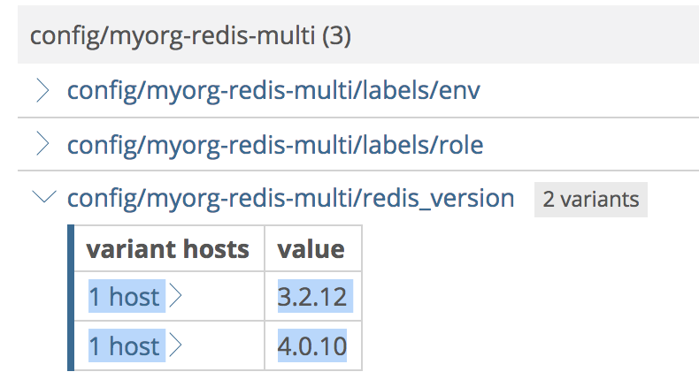
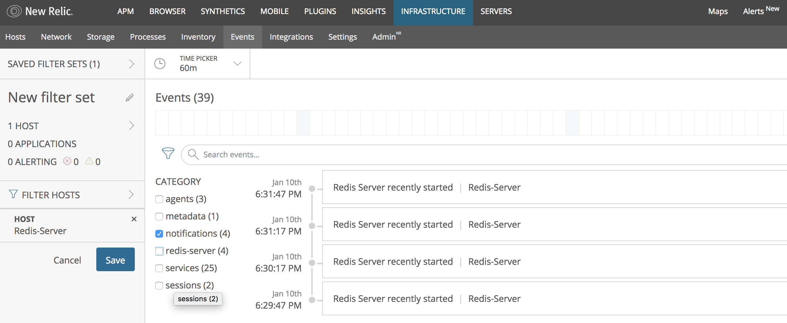
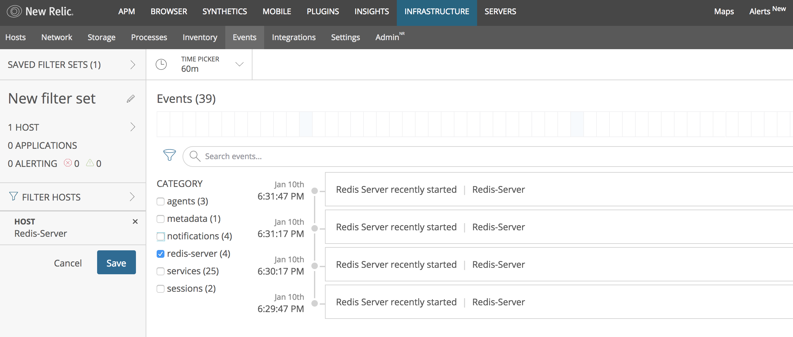

# Tutorial multiple entities

If you are reading this tutorial means that you are familiar with the SDK and the term [multiple(or remote) entities](toolset/integration.md#entity).
Please if you're not go to the simpler [single/local entity tutorial](tutorial.md).

## Multiple Entities

We've added support for **multiple entities** in order to be able to cover use cases like this:

You are running multiple instances of redis and you want to monitor them using a custom integration. With 
the sdk v2 you will need to install an infra-agent and the custom integration in each redis instance so they'll get different 
entity Ids. That could be possible if you have each instance in a separated host but what will happen if you are running more
than one instance by host?

With SDK v2 you won't be able to do that since they will share the same entity ID and you won't be able to distinguish them when running
a query in [insights service](https://insights.newrelic.com/).

In order to be able to setup this scenario we provide a `docker-compose.yml` in [here](tutorial-code/multiple-entities/docker-compose.yml).

## Overview

This tutorial will guide you through the process of developing a custom integration for New Relic Infrastructure in the Go language. To simplify the process, New Relic provides the following tools:
* [nr-integrations-builder](https://github.com/newrelic/nr-integrations-builder): command line tool that generates an integration "scaffold", with basic integration files in the correct directory structure.
* [Integration Golang SDK](https://github.com/newrelic/infra-integrations-sdk/): a Golang package containing a set of useful functions and types for creating metrics and inventory data structure.

For a simple overview of what Infrastructure integrations are and how they work, see the [Intro to the Integrations SDK](https://docs.newrelic.com/docs/infrastructure/integrations-sdk/get-started/intro-infrastructure-integrations-sdk).

This tutorial is compatible with `nr-integration-builder` v1.0.x and `Integration Golang SDK` v3.0.x.

## Best Practices

New Relic infrastructure integrations provide several ways of monitoring entities:

- **Metrics**: Data that with high change ratio, usually with numeric values.
- **Events**: Event is a record of something happened an at a particular moment in time.
- **Inventory**: Detailed information on key-value format about an entity context, usually it does not change a frequently.
 

Use cases for **metric** entries:
* Resource consumption: IE memory/cpu usage, are already current infrastructure agent metrics.
* Clicks on a site/link: Counters are another great use of a metric.

Use cases for **events** entries:
* Errors: error reporting could be sent as events.
* Deployment start/end: deployments on start and end could be seen as 2 events.

Use cases for **inventory** entries:
* OS context: version, packages, services... So you can quickly identify which hosts require an update to fix a security vulnerability.
* App version: Ensure a version update was applied successfully across all your hosts.
* API version: Audit version discrepancies across your hosts.


## Prerequisites
To successfully complete this tutorial you must:
* Be familiar with Golang
* Install [the Vendor Tool for Go](https://github.com/kardianos/govendor)
* Have access to a [supported Linux OS](https://docs.newrelic.com/docs/infrastructure/new-relic-infrastructure/getting-started/compatibility-requirements-new-relic-infrastructure#operating-systems)
* Install [Go](https://golang.org/doc/install)
* Install [Redis](https://redis.io/topics/quickstart)
* Install [Docker](https://docs.docker.com/install/)
* Install [Docker-compose](https://docs.docker.com/compose/install/)
* Install the [New Relic Infrastructure Agent](https://docs.newrelic.com/docs/infrastructure/new-relic-infrastructure/installation/install-infrastructure-linux)

## Building the structure of the integration

**Step1: Install nr-integrations-builder**

Install `nr-integrations-builder`
```bash
$ go get github.com/newrelic/nr-integrations-builder
```

This command will create the `nr-integrations-builder` executable. Depending on your Go tools settings it could be placed inside `$GOBIN` or `$GOPATH/bin`. Make sure the directory of the folder with your Go binaries is placed in your `$PATH` environment variable and run
```bash
$ nr-integrations-builder --help
```
If the Golang binary folder is not in your `$PATH` you will have to run
```bash
$ $GOBIN/nr-integrations-builder --help
```
or
```bash
$ $GOPATH/bin/nr-integrations-builder --help
```

This tutorial assumes that your `$GOBIN` or `$GOPATH/bin` has been added to your `$PATH` environment variable.

**Step 2: Check govendor tool**

Before initializing the integration with `nr-integrations-builder` you have to check that the `govendor` tool (used for managing dependencies) is successfully installed. Run the following command:
```bash
$ govendor
```
You should receive the description about the `govendor` tool with the list of accepted commands. More information about the usage can be found in the [README.md](https://github.com/kardianos/govendor/blob/master/README.md).

**Step 3: Initialize the integration**

To see the list of the parameters that you can specify for `nr-integrations-builder`, type
```bash
$ nr-integrations-builder init --help
```
You will receive the following output
```
Initialize an integration generating a scaffold.

Usage:
  nr-integrations-builder init [integration name] [flags]

Flags:
  -n, --company-name string       Company name (required)
  -c, --company-prefix string     Company prefix identifier (required)
  -p, --destination-path string   Destination path for initialized integration (default "./")
  -e, --entity-type string        Type of entity to generate: [remote,local] (required) (default "remote")
  -h, --help                      help for init

Global Flags:
      --config string   config file (default is $HOME/.nr-integrations-builder.yaml)
      --verbose         verbose output
```
It's obligatory to specify `company-name` and `company-prefix` flags. Otherwise, the `nr-integrations-builder` will not initialize the integration.

To initialize the integration and generate the scaffold, run
```bash
$ nr-integrations-builder init integration_name --company-name "your-company-name"  --company-prefix "your-company-prefix"
```

After initializing the integration you should receive information that the scaffold was successfully created. If it failed you will get an error message.

Your current directory will be used as the default destination. The following structure of the files and folders will be created:

* _integration\_name_
  * CHANGELOG.md
  * LICENSE
  * README.md
  * Makefile
  * _company\-prefix_-_integration\_name_-config.yml
  * _company\-prefix_-_integration\_name_-config.yml.template
  * _company\-prefix_-_integration\_name_-definition.yml  
  * src
    * _integration\_name_.go  
    * _integration\_name_\_test.go
  * vendor
    * vendor.json
    * _external\_packages_name_

## Building a Redis integration using the Integration Golang SDK v3.0
**Step1:** Create the directory where you want to place the Redis integration (it needs to be under `$GOPATH/src`)
```bash
$ mkdir $GOPATH/src/myorg-integrations/
$ cd $GOPATH/src/myorg-integrations/
```
**Step2:** Initialize the integration
```bash
$ nr-integrations-builder init redis-multi --company-prefix "myorg" --company-name "myorganization" [-e remote]
```
**Step 3:** Build the executable file and test that the integration was created properly
```bash
$ make
$ ./bin/myorg-redis-multi -pretty
```
The following JSON payload will be printed to stdout:
```json
{
	"name": "com.myorganization.redis-multi",
	"protocol_version": "2",
	"integration_version": "0.1.0",
	"data": [
		{
			"entity": {
				"name": "instance-1",
				"type": "custom"
			},
			"metrics": [
				{
					"event_type": "CustomSample",
					"some-data": 1000
				}
			],
			"inventory": {
				"instance": {
					"version": "3.0.1"
				}
			},
			"events": [
				{
					"summary": "restart",
					"category": "status"
				}
			]
		},
		{
			"entity": {
				"name": "instance-2",
				"type": "custom"
			},
			"metrics": [
				{
					"event_type": "CustomSample",
					"some-data": 2000
				}
			],
			"inventory": {
				"instance": {
					"version": "3.0.4"
				}
			},
			"events": []
		}
	]
}
```
This is the basic JSON data format that is expected by the Infrastructure agent. The main logic is placed in `src/redis.go`, which is the source that will be compiled into [the integration executable file](https://docs.newrelic.com/docs/create-integration-executable-file).

When the integration is initialized with `nr-integrations-builder`, the
executable file builds the JSON output data with three header fields (_name_,
_protocol_version_,
_integration_version_),
[metrics data](https://docs.newrelic.com/docs/create-integration-executable-file#metric-data) (with
the mandatory _event_type_ field), and an empty structure for [inventory](https://docs.newrelic.com/docs/create-integration-executable-file#inventory) and [events data](https://docs.newrelic.com/docs/create-integration-executable-file#event-data).

The SDK package contains a function called `integration.New`, which initializes a new instance of integration data. If you run the following simplified `main` function that calls `integration.New`:
```go
// the code for populating Inventory and Metrics omitted
func main() {
	// Create Integration
	i, err := integration.New(integrationName, integrationVersion, integration.Args(&args))
	panicOnErr(err)

	// Create Entity, entities name must be unique
	e1, err := i.Entity("instance-1", "redis")
	panicOnErr(err)

	// Create another Entity
	e2, err := i.Entity("instance-2", "redis")
	panicOnErr(err)

	panicOnErr(i.Publish())
}
```
you will receive the following output:
```json
{
	"name": "com.myorganization.redis-multi",
	"protocol_version": "2",
	"integration_version": "0.1.0",
	"data": [
		{
			"entity": {
				"name": "instance-1",
				"type": "redis"
			},
			"metrics": [],
			"inventory": {},
			"events": []
		},
		{
			"entity": {
				"name": "instance-2",
				"type": "redis"
			},
			"metrics": [],
			"inventory": {},
			"events": []
		}
	]
}
```

The complete files for the Redis integration can be found in [tutorial-code](tutorial-code/multiple-entities). As the [docker-compose](tutorial-code/multiple-entities/docker-compose.yml)
to setup two redis instances with different versions. To set it up run:

```bash
docker-compose up -d
```

### Fetching metric data

Let's start by defining the metric data. `Metric.Set` is the basic structure for storing metrics. The `NewMetricSet` function returns a new instance of Metric.Set with its sample attached to the integration data.

Next, if you think it's necessary, modify the argument for `NewMetricSet` in the
code. By default, `nr-integrations-builder` generates an Event Type
automatically using the `company-prefix` flag (that you specified initializing the integration), name of the integration and the word: _'Sample'_.  Your `main`
function should look like:
```go
func main() {
	i, err := integration.New(integrationName, integrationVersion)
	panicOnErr(err)

	// Create Entity, entities name must be unique
	e1, err := i.Entity("instance-1", "custom")
	panicOnErr(err)
	// the code for populating Inventory omitted

	if args.All() || args.Metrics {
        m1, err := e1.NewMetricSet("CustomSample")
        panicOnErr(err)
        err = m1.SetMetric("some-data", 1000, metric.GAUGE)
        panicOnErr(err)
    }
    // Create another Entity
	e2, err := i.Entity("instance-2", "custom")
	panicOnErr(err)
    
	if args.All() || args.Metrics {
        m2, err := e2.NewMetricSet("CustomSample")
        panicOnErr(err)
        err = m2.SetMetric("some-data", 2000, metric.GAUGE)
        panicOnErr(err)
    }

	panicOnErr(i.Publish())
}
```
In order to define the metric value, we will use the function `SetMetric` from the `data/metric` package.

After building, formatting the source code and executing the integration the following output is returned:
```json
{
	"name": "com.myorganization.redis-multi",
	"protocol_version": "2",
	"integration_version": "0.1.0",
	"data": [
		{
			"entity": {
				"name": "instance-1",
				"type": "custom"
			},
			"metrics": [
				{
					"event_type": "CustomSample",
					"some-data": 1000
				}
			],
			"inventory": {},
			"events": []
		},
		{
			"entity": {
				"name": "instance-2",
				"type": "custom"
			},
			"metrics": [
				{
					"event_type": "CustomSample",
					"some-data": 2000
				}
			],
			"inventory": {},
			"events": []
		}
	]
}
```

The function `SetMetric` requires three arguments. The first one is the _metric name_, the second is the _metric value_, and the last one is the _source type_ of the metric.

The metric source type can be one of the following: GAUGE, RATE, DELTA or ATTRIBUTE. Continue reading to understand how to use the different source types.

The `redis-cli info` command returns a list of redis performance and health metrics.

If you run:
```bash
redis-cli info | grep instantaneous_ops_per_sec:
```
you will receive:
```bash
instantaneous_ops_per_sec:4
```
This is the number of commands processed per second. This is a numeric value
that may increase or decrease and it should be stored as-is. Use the GAUGE
source type in these cases. For metric names, it is recommended that you use a prefix to categorize
them (check [the currently used prefixes](https://docs.newrelic.com/docs/infrastructure/integrations-sdk/file-specifications/integration-executable-file-specifications#metric-data)), innerCamelCase naming format, and specify the measurement unit using a unit suffix, i.e. PerSecond. In this case, for the metric data key, use `query.instantaneousOpsPerSecond`:

```go
// the code for populating Inventory omitted
func queryGaugeRedisInfo(query string, port int) (float64, error) {
	cmd := exec.Command("/bin/sh", "-c", fmt.Sprintf("redis-cli -p %d info | grep %s", port, query))
	output, err := cmd.CombinedOutput()
	if err != nil {
		return 0, err
	}
	splittedLine := strings.Split(string(output), ":")
	if len(splittedLine) != 2 {
		return 0, fmt.Errorf("Cannot split the output line")
	}
	return strconv.ParseFloat(strings.TrimSpace(splittedLine[1]), 64)
}

func main() {
	// Create Integration
	i, err := integration.New(integrationName, integrationVersion, integration.Args(&args))
	panicOnErr(err)

	// Create Entity, entities name must be unique
	e1, err := i.Entity("instance-1", "redis")
	panicOnErr(err)
	// Add Metric
	if args.All() || args.Metrics {
		m1, err := e1.NewMetricSet("MyorgRedisSample")
		panicOnErr(err)
		metricValue, err := queryGaugeRedisInfo("instantaneous_ops_per_sec:", instanceOnePort)
		panicOnErr(err)
		err = m1.SetMetric("query.instantaneousOpsPerSecond", metricValue, metric.GAUGE)
		panicOnErr(err)
	}

	// Create another Entity
	e2, err := i.Entity("instance-2", "redis")
	panicOnErr(err)

	if args.All() || args.Metrics {
		m2, err := e2.NewMetricSet("MyorgRedisSample")
		panicOnErr(err)
		metricValue, err := queryGaugeRedisInfo("instantaneous_ops_per_sec:", instanceTwoPort)
		panicOnErr(err)
		err = m2.SetMetric("query.instantaneousOpsPerSecond", metricValue, metric.GAUGE)
		panicOnErr(err)
	}

	panicOnErr(i.Publish())
}
```

In order to continue to build the source, you'll need to add the needed packages to the import statement at the top of the program:

```go
import (
	"fmt"
	sdkArgs "github.com/newrelic/infra-integrations-sdk/args"
	"github.com/newrelic/infra-integrations-sdk/log"
    "github.com/newrelic/infra-integrations-sdk/data/metric"
    "github.com/newrelic/infra-integrations-sdk/integration"
	"os/exec"
	"strconv"
	"strings"
)
```

After building, formatting the source code, and executing the integration, you should receive:

```json
{
	"name": "com.myorganization.redis-multi",
	"protocol_version": "2",
	"integration_version": "0.1.0",
	"data": [
		{
			"entity": {
				"name": "instance-1",
				"type": "redis"
			},
			"metrics": [
				{
					"event_type": "MyorgRedisSample",
					"query.instantaneousOpsPerSecond": 2
				}
			],
			"inventory": {},
			"events": []
		},
		{
			"entity": {
				"name": "instance-2",
				"type": "redis"
			},
			"metrics": [
				{
					"event_type": "MyorgRedisSample",
					"query.instantaneousOpsPerSecond": 1
				}
			],
			"inventory": {},
			"events": []
		}
	]
}
```

Using the command:

```bash
redis-cli info | grep total_connections_received:
```

you will receive:

```bash
total_connections_received:111
```

This provides information about the total number of connections accepted by the server. This is an ever-growing value which might be reset. In a case like this it is more useful to store the change rate instead of the as-is value. We use the RATE type and the SDK will automatically compute the change rate.

Modify the `setMetric` third argument to process the metric data using the RATE type:

```go

func main() {
    // ...
    // code for creating the integration and entity omitted
    // code for creating metric set in the second instance omitted
    // ...
    // Add Metric
    if args.All() || args.Metrics {
        m1, err := e1.NewMetricSet("MyorgRedisSample")
        panicOnErr(err)
        metricValue, err := queryGaugeRedisInfo("instantaneous_ops_per_sec:", instanceOnePort)
        panicOnErr(err)
        err = m1.SetMetric("query.instantaneousOpsPerSecond", metricValue, metric.GAUGE)
        panicOnErr(err)
    }

    panicOnErr(integration.Publish())
}
```

Build, format the source code, and execute the integration, and then check the output (note: your metric values may vary.)

```json
{
	"name": "com.myorganization.redis-multi",
	"protocol_version": "2",
	"integration_version": "0.1.0",
	"data": [
		{
			"entity": {
				"name": "instance-1",
				"type": "redis"
			},
			"metrics": [
				{
					"event_type": "MyorgRedisSample",
					"query.instantaneousOpsPerSecond": 6
				}
			],
			"inventory": {},
			"events": []
		}
	]
}
```
The calculations for a given metric source type are handled by `SetMetric`; the only information you need to provide is the desired source type. Besides RATE and GAUGE type, there is a DELTA type, which is similar to RATE, but it is calculated as the difference between samples, not as a rate change, and the ATTRIBUTE type, which is used for string values.
[Here](toolset/integration.md#metrics) you can find the definition of the different source type.


This method of fetching data, shown above is not very efficient. You will want to fetch a set of data all at once, but this example just shows how to use the `SetMetric` function and the source types.

### Definition file
Let's look now at the definition file of the redis integration. In the file _myorg-redis-definition.yml_ under _command_ you can specify common arguments for all instances (that you will define in the config file) that you want to monitor.  

The schema that will contain the different data types is:

```yml
name: com.myorganization.redis
description: Reports status and metrics for redis service
protocol_version: 2
os: linux

commands:
  metrics:
    # ...
  inventory:
    # ...
  events:
    # ...
```

### Configuration of the integration (for metrics)
In this case we have just one common argument: `--metrics`.

[Definition file](#Definition-file) will contain the `metrics` section:

```yml
  metrics:
    command:
      - ./bin/myorg-redis
      - --metrics
    interval: 15
```

The config file generated by `nr-integrations-builder` can be used as a basic example.
```yml
integration_name: com.myorganization.redis
instances:
  - name: redis
    command: all_data
```

There is also a config file template generated by `nr-integrations-builder` that shows more options.  
  
```yml
integration_name: com.myorganization.redis

instances:
  - name: <INSTANCE IDENTIFIER>
    command: metrics
    arguments:
      arg1: <ARG_VALUE>
    labels:
      key1: <LABEL_VALUE>

  # configuration for the inventory omitted
```
It is required to specify instances that you want to monitor. Arguments and labels parameters are not mandatory. For fetching metric data for the redis integration there is no argument needed. But we can specify the label with the environment name and the role. Make sure that you use valid YAML file format.
```yml
integration_name: com.myorganization.redis

instances:
  - name: redis-server-metrics
    command: metrics
    labels:
      env: production
      role: cache

    # configuration for the inventory omitted
```
This configuration is only for metric data. The configuration for inventory will be done further along in this tutorial.

The last configuration step for metrics is to place the integration file in the directory used by the Infrastructure agent. Place the executable and the definition file in `/var/db/newrelic-infra/custom-integrations/`

```bash
$ sudo cp $GOPATH/src/myorg-integrations/redis/myorg-redis-definition.yml /var/db/newrelic-infra/custom-integrations/myorg-redis-definition.yaml
$ sudo cp -R $GOPATH/src/myorg-integrations/redis/bin /var/db/newrelic-infra/custom-integrations/
```
Place the integration config file in `/etc/newrelic-infra/integrations.d/`
```bash
$ sudo cp $GOPATH/src/myorg-integrations/redis/myorg-redis-config.yml /etc/newrelic-infra/integrations.d/myorg-redis-config.yaml
```
When all the above steps are done, restart the agent.

For more information, see the [configuration file](https://docs.newrelic.com/docs/create-integration-config-file) and [definition file](https://docs.newrelic.com/docs/create-integration-definition-file) documentation.
### View metric data in New Relic Insights
When the integration and the Infrastructure agent are communicating correctly, you can view your metric data in [New Relic Insights](https://docs.newrelic.com/docs/find-use-infrastructure-integration-data#metric-data).

Below are example NRQL queries for the `MyorgRedisSample` event type.

<!--- 
TODO: Add screenshot of the results of the queries for remote entities. 
-->
```
NRQL> SELECT average(`net.connectionsReceivedPerSecond`) FROM MyorgRedisSample TIMESERIES
NRQL> SELECT average(`query.instantaneousOpsPerSecond`) FROM MyorgRedisSample TIMESERIES
```

For more about creating NRQL queries, see [Introduction to NRQL](https://docs.newrelic.com/docs/insights/nrql-new-relic-query-language/using-nrql/introduction-nrql). For more on where to find integration data in New Relic products, see [Find and use integration data](https://docs.newrelic.com/docs/infrastructure/integrations-sdk/use-integration-data/find-use-infrastructure-integration-data).

If you do not see your metric data in New Relic Insights, please check [configuration of the Infrastructure agent](https://docs.newrelic.com/docs/infrastructure/new-relic-infrastructure/configuration/configure-infrastructure-agent).

### Fetching Inventory data
This snippet shows where you can add inventory data:
```go
func main(){
    // ...
    // code for creating the integration and entity omitted
    // code for populating Inventory and Metrics omitted
    // ...
    // Add Inventory item
    if args.All() || args.Inventory {
        // Insert here the logic of your integration to get the inventory data
    	// err = entity.SetInventoryItem("instance", "version", "3.0.1")
        //panicOnErr(err)
    }
}

```
Notice that in the code above we use the `SetInventoryItem` method stores a value into the inventory data structure. The first argument is the name of the inventory item, and the other two are a field name and the inventory data value.

Let's assume that we want to collect information for Redis. For example, let's say we'd like to capture the value of the `redis_version` parameter. The command
```bash
redis-cli info |grep redis_version
```
gives the following result
```
redis_version:4.0.10
```

To parse this output and create the proper inventory data structure, use the `queryAttrRedisInfo` function:
```go

func queryAttrRedisInfo(query string, port int) (string, string) {
	cmd := exec.Command("/bin/sh", "-c", fmt.Sprintf("redis-cli -p %d info | grep %s", port, query))
	output, err := cmd.CombinedOutput()
	if err != nil {
		return "", ""
	}
	splittedLine := strings.Split(string(output), ":")
	if len(splittedLine) != 2 {
		return "", ""
	}
	return strings.TrimSpace(splittedLine[0]), strings.TrimSpace(splittedLine[1])
}

func main(){
    // ...
    // code for creating the integration and entity omitted
    // ...
	// Add Inventory item
	if args.All() || args.Inventory {
    		key, value := queryAttrRedisInfo("redis_version", instanceOnePort)
    		if key != "" {
    			err = e1.SetInventoryItem(key, "value", value)
    		}
    		panicOnErr(err)
    }
}
```

After building, formatting the source code and executing the integration (with just inventory data)
```bash
$ ./bin/myorg-redis -pretty -inventory
```
we receive
```json
{
	"name": "com.myorganization.redis-multi",
	"protocol_version": "2",
	"integration_version": "0.1.0",
	"data": [
		{
			"entity": {
				"name": "instance-1",
				"type": "redis"
			},
			"metrics": [],
			"inventory": {
				"redis_version": {
					"value": "4.0.10"
				}
			},
			"events": []
		},
		{
			"entity": {
				"name": "instance-2",
				"type": "redis"
			},
			"metrics": [],
			"inventory": {
				"redis_version": {
					"value": "3.2.12"
				}
			},
			"events": []
		}
	]
}
```

### View inventory data in Infrastructure
Inventory data can be viewed in New Relic Infrastructure on the [Inventory page](https://docs.newrelic.com/docs/infrastructure/new-relic-infrastructure/infrastructure-ui-pages/infrastructure-inventory-page-search-your-entire-infrastructure). Filter by prefix `config/myorg-redis` (which was specified in the definition file) and you will see the inventory data collected by the redis integration and labels that you specified in [the config file](tutorial-code/myorg-redis-config.yml).




See more about how inventory data shows up in the New Relic UI in [Find integration inventory data](https://docs.newrelic.com/docs/find-use-infrastructure-integration-data#inventory-data).

### Fetching events data
The last type of data that an Infrastructure integration can generate is events. Events are used to record important activities on a system, i.e. a service starting. We will implement this event for a Redis server.

For representing events, we use the `Event` structure, which has `Summary` and `Category` fields. The `Summary` field is obligatory and it stores a message to be sent. `Category` is optional and it's useful for grouping and finding events in the Infrastructure Events tabs. There are no limits for the `Category` value. Check the [list of examples of categories](https://docs.newrelic.com/docs/infrastructure/integrations-sdk/file-specifications/integration-executable-file-specifications#event-data).
By default , the `notifications` event category is used. Let's start with the function for creating an event with the default category. 

The command `redis-cli info` provides information about uptime of the Redis server. If you run:
```bash
redis-cli info | grep uptime_in_seconds:
```
you will receive (value will vary):
```bash
uptime_in_seconds:54782
```

We assume that when the uptime is less than 60 seconds, the Redis service has recently started. We will call the `redis-cli info | grep uptime_in_seconds:` command and then create a notification event if the uptime value is smaller than a defined limit. To do so, we will use the type of event `event.NewNotification`, which is a event with the default `notifications` category for an integration object. It accepts the `string` argument, which is a summary message, i.e. `"Redis Server recently started"`.

```go
func main(){
    // ...
    // code for creating the integration and entity omitted
    // code for populating Inventory and Metrics omitted
    // ...
    if args.All() || args.Events {
        uptime, err := queryGaugeRedisInfo("uptime_in_seconds:")
        panicOnErr(err)
        if uptime < 60 {
            err = e1.AddEvent(event.NewNotification("Redis Server recently started"))
        }
        panicOnErr(err)
    }
}

```

Then, update `main()` function including the snippet above that add events.

```go
func main() {
 	// Create Integration
 	i, err := integration.New(integrationName, integrationVersion, integration.Args(&args))
 	panicOnErr(err)
 
 	// Create Entity, entities name must be unique
 	e1, err := i.Entity("instance-1", "redis")
 	panicOnErr(err)
 	// Add event when redis starts
 	if args.All() || args.Events {
 		uptime, err := queryGaugeRedisInfo("uptime_in_seconds:", instanceOnePort)
 		panicOnErr(err)
 		if uptime < 60 {
 			err = e1.AddEvent(event.NewNotification("Redis Server recently started"))
 		}
 		panicOnErr(err)
 	}
 
 	// Add Inventory item
 	if args.All() || args.Inventory {
 		key, value := queryAttrRedisInfo("redis_version", instanceOnePort)
 		if key != "" {
 			err = e1.SetInventoryItem(key, "value", value)
 		}
 		panicOnErr(err)
 	}
 
 	// Add Metric
 	if args.All() || args.Metrics {
 		m1, err := e1.NewMetricSet("MyorgRedisSample")
 		panicOnErr(err)
 		metricValue, err := queryGaugeRedisInfo("instantaneous_ops_per_sec:", instanceOnePort)
 		panicOnErr(err)
 		err = m1.SetMetric("query.instantaneousOpsPerSecond", metricValue, metric.GAUGE)
 		panicOnErr(err)
 	}
 	// code for second entity omitted.
 
 	panicOnErr(i.Publish())
 }
```

Format the source code, build and execute the integration. In order to fetch only events data, use `-events` flag. 
```bash
$ go fmt src/redis.go
$ make
$ ./bin/myorg-redis -pretty -events
```

If Redis server was recently started, you will receive the following output:

```json
{
	"name": "com.myorganization.redis-multi",
	"protocol_version": "2",
	"integration_version": "0.1.0",
	"data": [
		{
			"entity": {
				"name": "instance-1",
				"type": "redis"
			},
			"metrics": [],
			"inventory": {},
			"events": [
				{
					"summary": "Redis Server recently started",
					"category": "notifications"
				}
			]
		},
		{
			"entity": {
				"name": "instance-2",
				"type": "redis"
			},
			"metrics": [],
			"inventory": {},
			"events": [
				{
					"summary": "Redis Server recently started",
					"category": "notifications"
				}
			]
		}
	]
}
``` 
Otherwise, `events` list will be empty:
```json
{
	"name": "com.myorganization.redis-multi",
	"protocol_version": "2",
	"integration_version": "0.1.0",
	"data": [
		{
			"entity": {
				"name": "instance-1",
				"type": "redis"
			},
			"metrics": [],
			"inventory": {},
			"events": []
		},
		{
			"entity": {
				"name": "instance-2",
				"type": "redis"
			},
			"metrics": [],
			"inventory": {},
			"events": []
		}
	]
}
```


Now, let's assume that we would like to create an event with a different category. To easily identify a new event in the Infrastructure Events UI, we will use a new category called `redis-server`. To do that we will use the same method as before `AddEvent` but instead of using
the `newNotification` method we will use the `Event` constructor and set the category to `redis-server`.  

```go
func main(){
    // ...
    // code for creating the integration and entity omitted
    // code for populating Inventory and Metrics omitted
    // ...
    if args.All() || args.Events {
        uptime, err := queryRedisInfo("uptime_in_seconds:")
        panicOnErr(err)
        if uptime < 60 {
            err = e1.AddEvent(event.NewNotification("Redis Server recently started"))
        }
        panicOnErr(err)
        if uptime < 60 {
            err = e1.AddEvent(event.New("Redis Server recently started", "redis-server"))
        }
        panicOnErr(err)
    }
}
```

After formating the source code, building and executing the integration with the command:
```bash
$ ./bin/myorg-redis -pretty
```
check that the integration was created properly (this output assume that your Redis server was started in the latest 60 seconds.).

```json
{
	"name": "com.myorganization.redis-multi",
	"protocol_version": "2",
	"integration_version": "0.1.0",
	"data": [
		{
			"entity": {
				"name": "instance-1",
				"type": "redis"
			},
			"metrics": [
				{
					"event_type": "MyorgRedisSample",
					"query.instantaneousOpsPerSecond": 0
				}
			],
			"inventory": {
				"redis_version": {
					"value": "4.0.10"
				}
			},
			"events": [
				{
					"summary": "Redis Server recently started",
					"category": "notifications"
				},
				{
					"summary": "Redis Server recently started",
					"category": "redis-server"
				}
			]
		},
		{
			"entity": {
				"name": "instance-2",
				"type": "redis"
			},
			"metrics": [
				{
					"event_type": "MyorgRedisSample",
					"query.instantaneousOpsPerSecond": 0
				}
			],
			"inventory": {
				"redis_version": {
					"value": "3.2.12"
				}
			},
			"events": [
				{
					"summary": "Redis Server recently started",
					"category": "notifications"
				},
				{
					"summary": "Redis Server recently started",
					"category": "redis-server"
				}
			]
		}
	]
}
```

As you can see in the output above, there was a second event created, with a new category `redis-server`.

### Configuration of the integration (for events)
To test the integration with the Infrastucture Agent, it's required to update [the config file](tutorial-code/myorg-redis-config.yml) and [the definition file](tutorial-code/myorg-redis-definition.yml). Let's start with the definition file by adding the `events` command. 

[Definition file](#Definition-file) will contain the `events` section:
```yaml
  events:
    command:
      - ./bin/myorg-redis
      - --events
    interval: 60
```

Then we will use the `events` command in the `myorg-redis-config.yml` file specifying a new `redis-events` instance. 

```yaml
integration_name: com.myorganization.redis

instances:
  - name: redis-metrics
    command: metrics
    labels:
      env: production
      role: cache

  - name: redis-inventory
    command: inventory
    arguments:
      hostname: localhost
      port: 6379
    labels:
      env: production
      role: cache

  - name: redis-events
    command: events
    labels:
      env: production
      role: cache
```

In order to finish the events configuration, place the executable and the updated definition file in `/var/db/newrelic-infra/custom-integrations/`

```bash
$ sudo cp $GOPATH/src/myorg-integrations/redis/myorg-redis-definition.yml /var/db/newrelic-infra/custom-integrations/myorg-redis-definition.yaml
$ sudo cp -R $GOPATH/src/myorg-integrations/redis/bin /var/db/newrelic-infra/custom-integrations/
```
and the integration config file in `/etc/newrelic-infra/integrations.d/`
```bash
$ sudo cp $GOPATH/src/myorg-integrations/redis/myorg-redis-config.yml /etc/newrelic-infra/integrations.d/myorg-redis-config.yaml
```
When all the above steps are done, restart the agent.

### View events data in Infrastructure

Event data can be viewed in New Relic Infrastructure on the [Events page](https://docs.newrelic.com/docs/infrastructure/new-relic-infrastructure/infrastructure-ui-pages/infrastructure-events-page-live-feed-every-config-change). Use the events category to filter events created by the integration.

View for `notifications` events:


View for `redis-server` events:


See more about how events data shows up in the New Relic UI in [Find integration events data](https://docs.newrelic.com/docs/infrastructure/integrations-getting-started/getting-started/understand-integration-data-data-types#event-data).