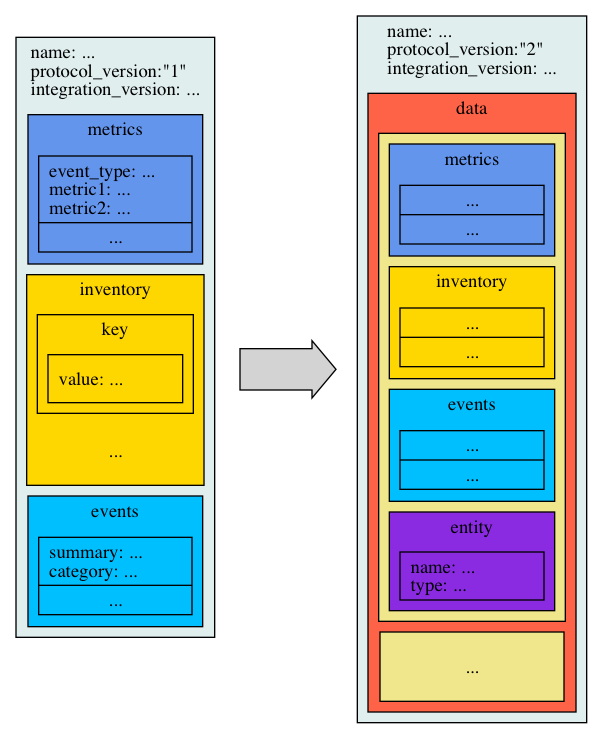

# Upgrading from GoSDK v2.x to GoSDK v3

This document targets the current GoSDK `v2.x` users that want to quickly know what has changed in the new GoSDK `v3` and
what they need to do if they want to upgrade to GoSDK `v3`.

The GoSDK `v3` has added the following new features that you should note in upgrading.
* A new JSON protocol (`v2`)
* Support for monitoring multiple entities through, what we refer to as `remote entities`
* The API has been totally reworked to decouple the JSON schema from the API that manages it.

The following section explains the changes from JSON `v1` to `v2` schema. Since GoSDK `v3` API hides
all the JSON schema details, you may want to go directly to the
[GoSDK `v3` API changes](#gosdk-v3-api-changes) section.

**Note:**

The GoSDK v3 removes support for version `v1` of the JSON Schema. However, `v1` schema is still supported by the New Relic
Infrastructure agent. If you want to work with `v1` JSON schema you can still work with our [GoSDK `v2.1.0`](`https://github.com/newrelic/infra-integrations-sdk/tree/v2.1.0`), which is also supported by New Relic.

JSON Schemas support table:

||JSON `v1`|JSON `v2`|
|--:|:-:|:-:|
|GoSDK `v1.x`|✅|❌|
|GoSDK `v2.x`|✅|❌|
|GoSDK `v3`|❌|✅|

## JSON `v2` schema changes

The previous version of the GoSDK used the JSON `v1` schema, which stored information about the
`metrics`, `inventory` and `events` of the entity being monitored (e.g. an
[Apache](https://github.com/newrelic/infra-integrations/tree/master/integrations/apache)
or a [MySQL](https://github.com/newrelic/infra-integrations/tree/master/integrations/mysql) instance).
Each `v1` payload contained the information of a single entity (often located in the same host as the
integration).

In order to support modern distributed environments (e.g. [Kubernetes](https://kubernetes.io/)), our
Go-SDK v3 adopts the `v2` JSON schema, which encloses `metrics`, `inventory` and `events` information for
multiple entities (e.g. multiple VMs, containers, storage, etc... See the following figure). 



In the `v2` JSON schema, multiple entities are stored into a list named `data`. Each entity keeps the
`metrics`, `inventory` and `events` from the `v1`, and adds the new `entity` object, which contains the
following two fields:

* `name`: the identifier/name of the entity.
* `type`: the kind of the entity. It will be used by the Agent as a namespace to compose a unique
identifier, in conjunction with `name`.

<!--
HIDDEN, since this probably will be set by the agent.

The `v2` JSON schema also adds the following fields for each entry in the `metrics` list:
* `entityName`: which should match the concatenation of values from `entity.type:entity.name`.
* `displayName`: expected display name in the New Relic User Interface.
-->

### `v2` JSON full sample
      
```json
{
  "name": "my.company.integration",
  "protocol_version": "2",
  "integration_version": "x.y.z",  
  "data": [
    {
      "entity": {
        "name": "my_garage",
        "type": "building"
      },
      "metrics": [
        {
          "temperature": 25.3,
          "humidity": 0.45,
          "displayName": "my_garage",
          "entityName": "building:my_garage",
          "event_type": "BuildingStatus"
        }
      ],
      "inventory": {
        "out_door": {
          "status": "open"
        }
      },
      "events": []
    },
    {
      "entity": {
        "name": "my_family_car",
        "type": "car"
      },
      "metrics": [
        {
          "speed": 95,
          "fuel": 768,
          "displayName": "my_family_car",
          "entityName": "car:my_family_car",
          "event_type": "VehicleStatus"
        }
      ],
      "inventory": {
        "motor": {
          "brand": "renault",
          "cc": 1800
        }
      },
      "events": [
        {
          "category": "gear",
          "summary": "gear has been changed",
          "attributes": {
            "oldGear": 3,
            "newGear": 4,
            "transmission": "manual"
          }
        }
      ]
    }
  ]
}
```


## GoSDK `v3` API changes

This section enumerates the main changes you have to keep in mind if you want to upgrade from GoSDK `v2.x` to `v3`.

For a complete view of the GoSDK `v3` tools, please refer to [toolset](/docs/toolset)

### Data persistence

* The `cache.Cache` component has been renamed to `persist.Storer`, to align more with the implementation.
* While `cache.Cache` was a global object, now `persist.Storer` is not global anymore.
* `persist.Storer` is an interface that accepts multiple implementations: in-memory, disk-backed, or any other
  implementation provided by the user.
* The file location of the disk-backed `persist.Storer` can be configured.
* `cache.Cache` used an environment variable called `NRIA_CACHE_PATH` as the 
  directory for storing the cache, if this variable was not set a warning 
  was raised and a temporal directory was used instead. With `persist.Storer`
  the `NRIA_CACHE_PATH` is no longer used and the default behavior is storing
  the files in a temporal directory.

### Logging

* The global logger has been deprecated. Now the user can specify the logger implementation through the `log.Logger` interface.

### Integration creation and publication

* High-level of user customization through configuration arguments in the instantiation. Now the user
  can specify:
  - Output of the integration JSON payload (default: standard output).
  - Logger.
  - `persist.Storer` implementation.
  - Destination object where the command-line/environment flags will be parsed to.
* Package `sdk` renamed to `integration`
* Some member names changed, e.g. `MetricSet` is now `metric.Set`
* Added `EntityMetadata` struct to fulfill the [JSON `v2` schema](#json-v2-schema-changes).

## Migrate from `v2` to `v3` steps
### Imports
* First of all we've renamed some packages. So the first you can do when migrating from `v2` to `v3` is run these commands inside your 
integration src folder :

```bash
find . -type f -iname "*.go" |xargs -I {} sed -i '' 's#github.com/newrelic/infra-integrations-sdk/sdk#github.com/newrelic/infra-integrations-sdk/integration#' {}
find . -type f -iname "*.go" |xargs -I {} sed -i '' 's#github.com/newrelic/infra-integrations-sdk/cache#github.com/newrelic/infra-integrations-sdk/persist#' {}
find . -type f -iname "*.go" |xargs -I {} sed -i '' 's#github.com/newrelic/infra-integrations-sdk/metric#github.com/newrelic/infra-integrations-sdk/data/metric#' {}
``` 

These commands will change all references to old packages and use the new ones.
Expect things to crash right now since all the references to sdk will now fail.

In `v3` metrics, inventory or events cannot be attached to the integration itself but to `Entities`. So things like this 
does not makes sense anymore:
```bash
integration, err := sdk.NewIntegration(integrationName, integrationVersion, &args)
integration.NewMetricSet("ApacheSample")
``` 

Instead it should be like this:
 
 ```bash
 integration, err := integration.New(integrationName, integrationVersion, integration.Args(&args))
 e := integration.LocalEntity() # Local or remote entity it depends in the use case
 e.NewMetricSet("TestSample")
 ```

Or in the case of **remote** entities:
 ```bash
 integration, err := integration.New(integrationName, integrationVersion)
 e := integration.Entity("Entity1", "test") # Local or remote entity it depends in the use case
 e.NewMetricSet("TestSample")
 ```

Besides all of the changes mentioned above these are some terms that you can look for in your integration code and the `v3`
 version of them.


| v2                        | v3                                |
| ------------------------- | --------------------------------- |
| `sdk.NewIntegration()`    | `integration.New()`               |
| `args.All`                | `args.All()`                      |
| `sdk.Inventory`           | `inventory.Inventory`             |
| `make(sdk.Inventory)`     | `*inventory.New()`                |
| `inventory["foo"]["bar"]` | `inventory.Items()["foo"]["bar"]` |
| `len(inventory)`          | `len(inventory.Items())`          |
| `metric.MetricSet`        | `metric.Set`                      |


## References

* Official public `Entity` definition https://docs.newrelic.com/docs/using-new-relic/welcome-new-relic/getting-started/glossary#alert-entity
